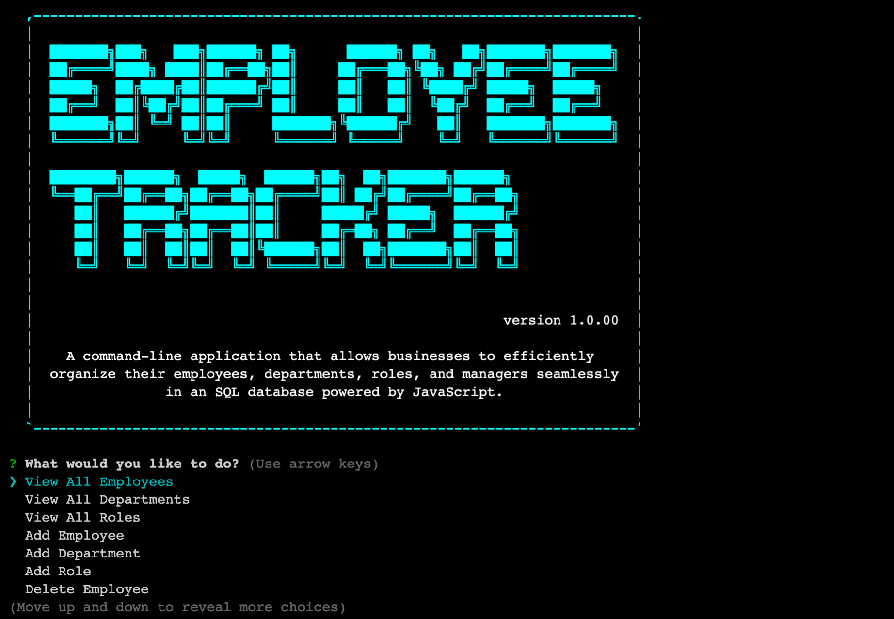

# Employee Tracker

## Description

Developers are often tasked with creating interfaces that make it easy for non-developers to view and interact with information stored in databases. Often these interfaces are known as Content Management Systems. In this project, I built a solution for managing a company's employees using node, inquirer, and MySQL.

## Table of Contents

* [Installation](#installation)
* [Usage](#usage)
* [Contributing](#contributing)
* [License](#license)
* [Questions](#questions)

## Installation

* Step 1: Install [Node.js](https://nodejs.org/).
* Step 2: Clone this repository to your local drive.
* Step 3: Open Git Bash (PC) or Terminal (Mac) and navigate to the root directory of this cloned repository.
* Step 4: Enter `npm i` in the command line to install all dependencies detailed in the package.json file.
* Step 5: Copy the `schema.sql` and `seed.sql` code located in the `db` directory. Paste the code in `MySQLWorkbench` to create the required database structure for this application. Make sure to input your own unique MySQL user and password credentials in the `mysql.createConnection` function on line 5 in order to successfully connect the database to your `server.js` file. 
* Step 6: Enter `node server.js` in the command line to invoke the application.

## Usage

As a business owner, I want to view, add, and update employee roles in my company so that I can organize and plan my business. This application uses the following technologies:

* JavaScript
* Node.js
* Inquirer.js
* MySQL

https://www.loom.com/share/ecbda0728b584506bb363d675c401dca

## Contributing

Please ensure that your pull request adheres to the following guidelines:

* Alphabetize your entry.
* Search previous suggestions before making a new one, as yours may be a duplicate.
* Suggested README's should be beautiful and/or stand out in some way.
* Make an individual pull request for each suggestion.
* New categories, or improvements to the existing categorization are welcome.
* Keep descriptions short and simple, but descriptive.
* Start the description with a capital and end with a full stop/period.
* Check your spelling and grammar.
* Make sure your text editor is set to remove trailing whitespace.
* Use the `#readme` anchor for GitHub READMEs to link them directly

Thank you for your suggestions!

## License

This project is MIT licensed.

## Questions

For more information about this application, please feel free to contact me via the links below.

- [Github](https://www.github.com/milehighcoder)
- [Email](mailto:mgmartnz@icloud.com)
